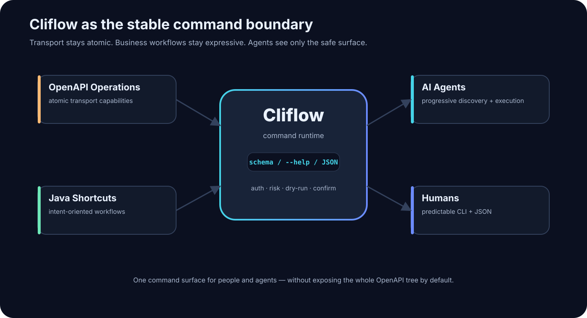
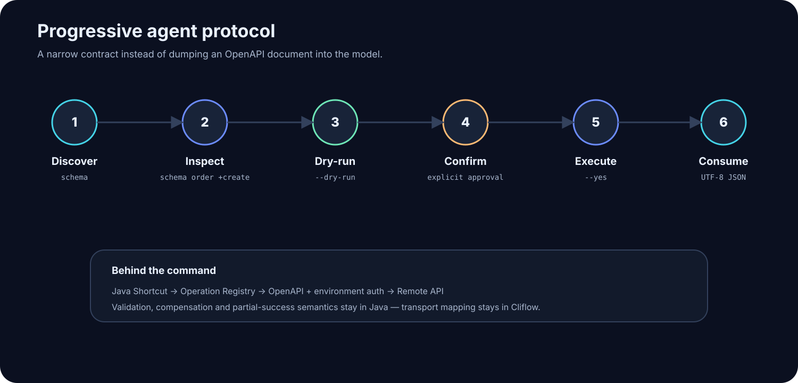
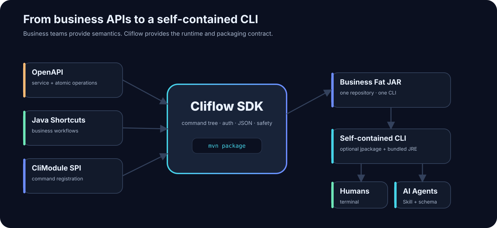
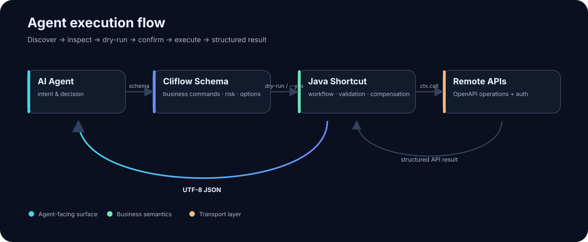

<p align="center">
  
</p>

<p align="center">
  <a href="https://github.com/redSun64/cliflow/actions/workflows/ci.yml"></a>
  <a href="LICENSE"></a>
</p>

**Cliflow is a Java framework for turning APIs into composable, AI-friendly CLI commands.**

Cliflow 是一个 Java CLI Runtime：OpenAPI 负责原子传输能力，Java 负责真正的业务动作，Agent 通过 `schema` 渐进发现可安全调用的命令。

> 项目名称是 **Cliflow**；命令行程序叫 `cliflow`。

[English](README.md) · [架构说明](docs/architecture.md) · [业务 CLI 接入](docs/business-onboarding.md) · [参与贡献](CONTRIBUTING.md)

## 为什么需要 Cliflow

Agent 不能只面对一长串 HTTP 接口。真正可用的业务动作还需要明确意图、风险等级、确认规则、稳定 JSON 输出，以及多步骤编排的归属。

<p align="center">
  
</p>

- **OpenAPI 保持传输语义。** 自动生成的 operation 位于 `operations`，用于开发和排障。
- **Java 表达业务语义。** `+subcommand` 可编排多次调用、校验、补偿和 partial result。
- **Agent 只发现业务面。** `schema` 展示业务命令及其意图、参数、风险；默认隐藏底层 transport command。
- **安全能力内建。** 读写风险、`--yes`、dry-run、环境变量鉴权、结构化错误和 UTF-8 JSON 都由 Runtime 统一处理。
- **一个业务，一个 CLI。** 业务团队依赖 SDK、实现一个 SPI 模块，独立发行自己的 CLI。

## 为 Agent 设计，而不只是终端工具

Cliflow 给 Agent 的是一套小而渐进的调用协议，而不是要求它先读完整 OpenAPI、再猜测 Shell 命令。

<p align="center">
  
</p>

`schema` 只展示面向业务的 Shortcut。自动生成的 OpenAPI transport 命令保留在 `operations`，可用于开发或排障，但不会成为 Agent 的默认工具面。

例如，Agent 可以只查看一个动作，而不用加载无关命令：

```bash
cliflow schema employee +onboard
```

它会得到意图、参数、风险、确认和示例元数据，足以判断这个动作是否符合用户诉求。

## 快速开始

要求：**JDK 21**、**Maven 3.9+**。

```bash
git clone https://github.com/redSun64/cliflow.git
cd cliflow
mvn verify
java -jar acli-app/target/cliflow-sdk-0.1.0-SNAPSHOT-all.jar schema
```

仓库内带有示例业务模块。查看面向 Agent 的业务命令契约：

```bash
java -jar acli-app/target/cliflow-sdk-0.1.0-SNAPSHOT-all.jar schema employee +onboard
```

自动导入的 OpenAPI 命令只通过内部逃生舱暴露：

```bash
java -jar acli-app/target/cliflow-sdk-0.1.0-SNAPSHOT-all.jar operations
```

## 打成自带 JRE 的 CLI

`jpackage` 会生成自带 JRE 的应用镜像，使用者不用安装 Java；原生 launcher 必须在目标操作系统上构建。

```powershell
# Windows PowerShell，需要包含 jpackage 的完整 JDK
.\scripts\package.ps1
.\dist\cliflow\cliflow.exe --version
```

```bash
# Linux 或 macOS
./scripts/package.sh
./dist/cliflow/bin/cliflow --version
```

Windows launcher 的 stdout 和 stderr 始终使用 UTF-8，JSON 中的中文也能稳定输出。

## 核心概念

| 概念 | 责任 |
| --- | --- |
| Service | 一个远程系统，以及它的 URL、OpenAPI 和基于环境变量的鉴权配置。 |
| Operation | 一个原子 OpenAPI 能力，例如 `crm.createCustomer`。 |
| Shortcut | Java `+subcommand`，表达一个有业务含义的动作。 |
| `CliModule` | 业务 JAR 用来注册命令树和可选 Agent Skill 的 SPI 边界。 |
| `schema` | 面向 Agent 的渐进式业务发现，包含意图、参数、风险和确认规则。 |

在 Shortcut 中通过 `CommandContext` 调用 Operation：

```java
Customer customer = ctx.call(
    "crm.createCustomer",
    Map.of("name", name),
    Customer.class
);
```

业务代码不构造 HTTP 请求，也不读取 Token。

## 构建独立业务 CLI

每个业务自己维护一个仓库、发布一个 CLI。业务方在构建期依赖 SDK、运行时通过 Java SPI 接入；命令注册不依赖 Maven Plugin。

<p align="center">
  
</p>

职责边界如下：

| 业务团队提供 | Cliflow 提供 |
| --- | --- |
| OpenAPI、服务配置、Java Shortcut、一个 SPI 描述文件、可选 Skill | Launcher、命令树、OpenAPI 加载、HTTP 映射、鉴权、确认、dry-run、JSON 输出和命令发现 |

```xml
<parent>
  <groupId>io.github.redsun64.cliflow</groupId>
  <artifactId>cliflow-parent</artifactId>
  <version>0.1.0</version>
</parent>

<artifactId>order-cli</artifactId>

<dependencies>
  <dependency>
    <groupId>io.github.redsun64.cliflow</groupId>
    <artifactId>cliflow-sdk</artifactId>
    <version>0.1.0</version>
  </dependency>
</dependencies>
```

`0.1.0` 是计划中的首发坐标。在它发布前，请从本仓库以根 `pom.xml` 中的 `0.1.0-SNAPSHOT` 本地构建。

### 1. 描述远程服务

在业务仓库创建 `src/main/resources/META-INF/cliflow/services.yaml`：

```yaml
- id: crm
  name: CRM
  baseUrl: https://crm.example.com
  baseUrlEnv: CRM_BASE_URL
  openapi: classpath:META-INF/cliflow/openapi/crm.yaml
  auth:
    type: bearer-env
    env: CRM_API_TOKEN
    required: true
```

相应 OpenAPI 放到 `src/main/resources/META-INF/cliflow/openapi/crm.yaml`。推荐提供 `operationId`；若导出文件缺失，Cliflow 会按照 HTTP method 和 path 推导稳定的 lowerCamelCase 名称。

### 2. 通过 SPI 注册业务动作

实现 `CliModule`，并通过 Java 标准 `ServiceLoader` 描述文件 `META-INF/services/io.github.redsun64.acli.api.CliModule` 发布：

```java
public final class OrderCliModule implements CliModule {
    @Override
    public void register(CommandRegistry commands, CommandContextFactory contextFactory) {
        CommandLine order = new CommandLine(new OrderCommand());
        order.addSubcommand("+create", new CreateOrderShortcut(contextFactory));
        commands.add(order);
    }
}
```

描述文件只有一行实现类名：

```text
com.example.order.OrderCliModule
```

执行 `mvn package` 后生成 `target/order-cli-<version>-all.jar`。父 POM 会合并 SPI 描述文件，并配置 Cliflow 的主类。

### 从 API 到 Agent 可用动作

<p align="center">
  
</p>

Shortcut 的业务失败语义由业务代码自己负责；补偿、partial success 和 unknown effect 都应该在 Java 工作流中显式表达。

## Agent Skill

业务模块可以提供一个静态 `CliSkill`。最终 CLI 可以把它安装到兼容 Agent 的发现目录：

```powershell
cliflow skills install
cliflow skills install --scope repo
cliflow skills install --dry-run
```

安装器会把当前打包 launcher 的绝对路径写入 Skill。Skill 只说明工作流和发现方式，不会替用户确认写操作。

## 安全模型

写操作必须显式确认；使用 `--dry-run` 可以先查看确定性的执行计划。

```bash
cliflow order +create --customer-id C-42 --dry-run --format json
cliflow order +create --customer-id C-42 --yes --format json
```

复合 Shortcut 必须明确自己的失败语义：

- **All-or-nothing：** 对已完成副作用补偿，并验证补偿结果。
- **Partial success：** 保留成功项，返回失败明细。
- **Unknown effect：** 超时后禁止盲目重试；先查询或使用幂等键确认真实状态。

## 开发者工具

下面的脚本会从最终 Picocli 命令树生成可评审的 Markdown：

```powershell
.\scripts\preview-commands.ps1
```

默认输出为 `acli-app/target/command-preview.md`，同时包含 Shortcut 和内部 OpenAPI 逃生舱。

## 项目结构

```text
cliflow-api       对外扩展契约和注解
cliflow-core      OpenAPI Loader、HTTP Runtime、鉴权、输出、Service Registry
cliflow-sdk       可运行 launcher、schema、Skill、生成命令
cliflow-parent    独立业务 CLI 的 Maven Parent POM
cliflow-example   示例 SPI 业务模块和 Skill
```

源码目录目前保留原有的 `acli-*` 名称，Maven artifact 名称才是对外发布契约。

## 路线图

- [ ] 发布 SDK artifact 和签名首发版本。
- [ ] 在业务方构建时校验外部 OpenAPI。
- [ ] 增加 audit/trace 透传扩展点。
- [ ] 提供可选 Maven Plugin，一键完成校验与本地 native 打包。
- [ ] 只有确实需要单二进制时，再评估 GraalVM Native Image。

## 参与贡献

欢迎 Issue 和 PR。请先阅读 [CONTRIBUTING.md](CONTRIBUTING.md)，不要把凭据写入 fixture 或日志，并在提交 PR 前运行 `mvn verify`。

## License

[MIT](LICENSE) © 2026 redSun64
